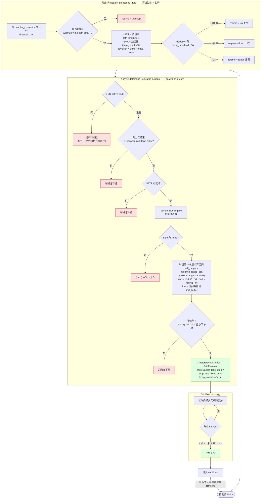
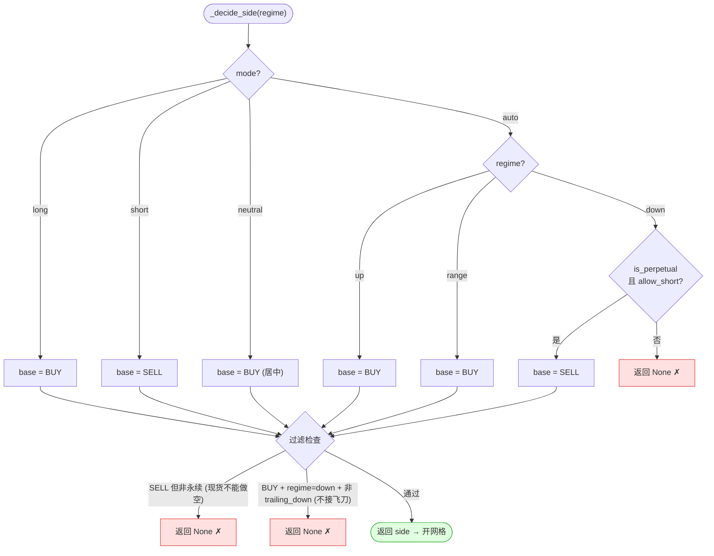

# SmartGrid 运行逻辑图解

> 控制器源码:`controllers/generic/smart_grid.py`
> 底层执行引擎:`hummingbot/strategy_v2/executors/grid_executor/grid_executor.py`
>
> SmartGrid 复用 Hummingbot 的 `GridExecutor`(自带现货/永续、三重风控、activation_bounds),
> 并补上内置网格缺的三件事:**① ATR 自适应区间 · ② EMA 趋势过滤 · ③ 移动网格(spawn-on-empty)**。

---

## 图 1 · 整体运行逻辑(每个 control loop tick 触发)

```
┌─────────────────────────────────────────────────────────────────────────┐
│                  控制循环 (每个 control loop tick 触发)                      │
└─────────────────────────────────────────────────────────────────────────┘
        │
        ├──────────────── 阶段 ① ────────────────┐
        ▼                                         │
┌───────────────────────────────────┐            │  update_processed_data()
│  从 candles_connector(如 okx)      │            │  —— 算"波动率 + 趋势"
│  拉 K 线 (interval=1m)             │            │
└───────────────────────────────────┘            │
        │                                         │
        ▼                                         │
   K线足够? (warmup =                              │
   max(atr, ema_len)+2)                           │
        │                                         │
   否 ──┴── 是                                     │
   │        │                                     │
   ▼        ▼                                     │
 regime=  ┌─────────────────────────────────┐    │
 warmup   │ NATR = 波动率 (atr_length=14)     │    │
          │ EMA  = 趋势线 (ema_length=50)     │    │
          │ deviation = (mid-ema)/ema        │    │
          │  > +阈值 → regime = "up"   (上涨)  │    │
          │  < -阈值 → regime = "down" (下跌)  │    │
          │  其余    → regime = "range"(震荡)  │    │
          └─────────────────────────────────┘    │
        ┌─────────────────────────────────────────┘
        ▼
        ├──────────────── 阶段 ② ────────────────┐
        ▼                                         │ determine_executor_actions()
┌───────────────────────────────────┐            │ —— "spawn-on-empty":同一时刻只跑1个网格
│  当前有 active grid 在跑?           │            │
└───────────────────────────────────┘            │
        │                                         │
   有 ──┴── 没有                                   │
   │         │                                    │
   ▼         ▼                                    │
 记录       距上次结束 < respawn_cooldown(30s)?     │
 时间戳      │                                     │
 不动手     是┴否                                  │
 (让网格    │  │                                   │
  自己的    ▼  ▼                                   │
  风控管)  等待  NATR 已就绪?                        │
           ┌──────┴── 否→等待                       │
           是                                      │
           ▼                                       │
   ┌──────────────────────────────────────────┐   │
   │   _decide_side(regime)  趋势过滤器           │   │
   │                                          │   │
   │  mode=long  → BUY                         │   │
   │  mode=short → SELL                        │   │
   │  mode=auto:                              │   │
   │     up    → BUY                           │   │
   │     down  → SELL (仅永续+allow_short) 否则✗  │   │
   │     range → BUY                           │   │
   │  过滤: 现货不能做空 → ✗                       │   │
   │  过滤: 下跌中开 BUY 且非 trailing_down → ✗    │   │
   └──────────────────────────────────────────┘   │
           │                                       │
      side=None ── 是 → 返回[] (本轮不开仓)           │
           │ 否                                     │
           ▼                                       │
   ┌──────────────────────────────────────────┐   │
   │  以当前 mid 为中心,用波动率算网格区间          │   │
   │  half_range = max(min_range_pct,          │   │
   │                   NATR × range_atr_mult)  │   │
   │  start = mid × (1 - half_range)           │   │
   │  end   = mid × (1 + half_range)           │   │
   │  limit = 区间外侧再留 limit_buffer (硬止损线)  │   │
   └──────────────────────────────────────────┘   │
           │                                       │
           ▼                                       │
   资金够吗? total_quote ≥ 3×最小下单额?            │
       否 → 不开 / 是 ↓                              │
           ▼                                       │
   ┌──────────────────────────────────────────┐   │
   │  CreateExecutorAction → GridExecutor       │   │
   │  带 TripleBarrier 三重风控:                  │   │
   │   • take_profit  每格止盈 (0.2%)            │   │
   │   • stop_loss    整体止损 (5%)              │   │
   │   • limit_price  冲出区间硬退出 (limit_buffer)│   │
   │  keep_position=False → 触发后平到 0 仓        │   │
   └──────────────────────────────────────────┘   │
        └──────────────────────────────────────────┘
           │
           ▼
┌─────────────────────────────────────────────────────────────────────────┐
│  GridExecutor 自行在区间内挂买卖单赚波动 → 命中任一 barrier 后平仓归零         │
│  → 进入 cooldown → 下一轮以"新的 mid"重新居中开网格  ★这就是"移动网格(trailing)"  │
│     价格涨出去 → 止盈平仓获利 → 在更高位重开 (trailing-up 自动)               │
└─────────────────────────────────────────────────────────────────────────┘
```

### 核心要点(3 句话)

1. **自适应区间**:网格宽度不是固定的,而是用 NATR(实际波动率)× 倍数算出来,行情波动大区间就宽。
2. **趋势过滤**:EMA 判断 up/down/range,决定开 BUY 还是 SELL,还是干脆不开(比如下跌中默认不接飞刀)。
3. **移动网格(spawn-on-empty)**:同一时刻只有 1 个网格;它靠自己的三重风控平仓归零,冷却后以**新中价重新居中**再开 —— 这样自动实现追涨(trailing-up)。

---

## 图 2 · 网格价格带示意(以 BUY 网格 / 现货为例)

前提:`mid=100,000`、波动率算出 `half_range=2%`、`activation_bounds=1%`、`take_profit≈0.2%`、`limit_buffer=2%`

```
  价格 ↑
        ┌───────────────────────────────────────────────────────────────┐
102,000 ┤ ═══ end_price = mid×(1+half_range) ═══ 网格上沿                   │
        │                                                                 │
101,800 ┤  L8  buy ……………… 已挂(冷,离现价>1%, activation_bounds 外暂不挂)    │
101,400 ┤  L7  buy ……………… (冷)                                            │
        │                                                                 │
        │  ╌╌╌╌╌╌╌╌╌╌╌╌ activation_bounds 上沿 (mid×1.01 ≈ 101,000) ╌╌╌╌╌  │
        │                                          ▲ 只有这条带内的格子      │
101,000 ┤  L6  ●buy 100,990 → ◇TP卖 101,190        │ 才真正挂单(同时最多      │
100,800 ┤  L5  ●buy 100,790 → ◇TP卖 100,990        │ max_open_orders=5 个)   │
100,600 ┤  L4  ●buy 100,590 → ◇TP卖 100,790        │                        │
100,400 ┤  L3  ●buy 100,390 → ◇TP卖 100,590        │  ← 买单约定→自动在        │
100,200 ┤  L2  ●buy 100,190 → ◇TP卖 100,390        │    上一格挂利确卖        │
        │                                          ▼                       │
100,000 ┤━━━━━━━━━━━━━━━ MID(中价,网格围绕它居中)━━━━━━━━━━━━━━━━━━━━━━━━━━ │
        │                                                                  │
 99,800 ┤  L1  ●buy 99,790  → ◇TP卖 99,990                                  │
 99,600 ┤  L0  ●buy 99,590  → ◇TP卖 99,790                                  │
        │  ╌╌╌╌╌╌╌╌╌╌╌╌ activation_bounds 下沿 (mid×0.99 ≈ 99,000) ╌╌╌╌╌    │
        │                                                                  │
 98,400 ┤  (更低的格子,价格跌下来才逐个激活买入)                              │
        │                                                                  │
 98,000 ┤ ═══ start_price = mid×(1-half_range) ═══ 网格下沿                  │
        │                                                                  │
        │  ⚠ 整体浮亏达 stop_loss=5% → 全部平仓(聚合止损)                     │
        │                                                                  │
 96,040 ┤ ███ limit_price = start_price×(1-limit_buffer) ███ 硬止损线        │
        │      价格跌穿这里 → GridExecutor 立即清仓离场                        │
        └──────────────────────────────────────────────────────────────────┘
  价格 ↓
```

### 图例 & 机制

| 符号 | 含义 |
|---|---|
| `●buy` | 该格的**买入挂单**(LIMIT_MAKER 只挂不吃) |
| `◇TP卖` | 买单成交后,自动在 **+take_profit(≈1 格)** 挂的**利确卖单** |
| `═══ end / start` | 网格上下沿,由 **NATR 波动率**动态算出(波动大→带更宽) |
| `╌╌ activation_bounds` | 离现价 ±1% 的「激活窗口」,只在窗口内真正挂单,价格移动时逐格激活 |
| `⚠ stop_loss` | **聚合**浮亏 5% → 整体平仓 |
| `███ limit_price` | 跌穿区间外侧的**硬止损线**,直接清仓 |

### 一格是怎么赚钱的

```
   价格在带内来回震荡:
   ① 价格下来 → ●buy 99,790 成交(买入)
   ② 系统立刻挂 ◇TP卖 99,990(+0.2%)
   ③ 价格反弹 → 卖单成交 → 这一格净赚 ≈0.2%(扣手续费)
   ④ 该格复位,等下次再买 → 周而复始,吃震荡
```

### 触发任一 barrier 后(衔接图 1)

```
  价格涨穿 end → 利确卖单陆续成交、平到 0 仓 → 冷却 → 以"更高的新 mid"重开网格 (trailing-up ↑)
  浮亏到 stop_loss / 跌穿 limit_price → 整体清仓 → 冷却 → 等趋势过滤器放行后再开
```

> 补充:
> - **永续 SELL 网格**就是上下镜像 —— 在带内**挂卖→跌一格利确买回**,`limit_price` 在区间**上方**(`end×(1+limit_buffer)`)。
> - SmartGrid 设了 `coerce_tp_to_step=True`,所以每格利确至少 = 一个网格步长,避免「卖价比买价还低」的亏损格。

---

## 关键参数速查(`SmartGridConfig`)

| 参数 | 默认 | 作用 |
|---|---|---|
| `connector_name` | `okx_demo` | 下单连接器(实盘改 `okx` / `okx_perpetual`) |
| `candles_connector` | `okx` | K 线来源(必须是真实行情,demo 无 K 线) |
| `mode` | `auto` | `auto`/`long`/`short`/`neutral` |
| `allow_short` | `False` | 下跌中开 SELL 网格(仅永续) |
| `atr_length` / `range_atr_mult` / `min_range_pct` | 14 / 4 / 0.01 | 自适应区间宽度 |
| `trend_ema_length` / `trend_threshold` | 50 / 0.004 | 趋势过滤 |
| `trailing_down` / `respawn_cooldown` | False / 30 | 移动网格行为 |
| `take_profit` / `stop_loss` / `limit_buffer` | 0.002 / 0.05 / 0.02 | 三重风控 |
| `total_amount_quote` | 200 | 单网格投入资金(quote) |

---

## 图 3 · Mermaid 流程图(可在 GitHub / IDE 渲染)



### 子图 · `_decide_side` 趋势过滤判定


